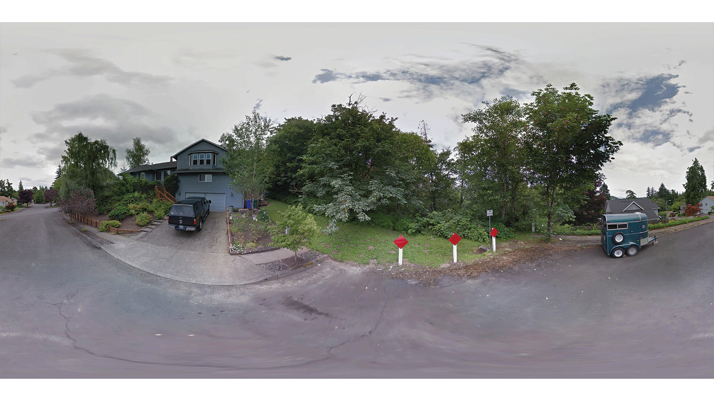

# GSV_NDVI_Comparison #

Readme file for the Google Street View - NDVI comparison project

**Author:** [Andrew Larkin](https://www.linkedin.com/in/andrew-larkin-525ba3b5/)  
**Affiliation:** [Oregon State University, College of Public Health and Human Sciences](https://health.oregonstate.edu/)  
**Principal Investigator:** [Perry Hystad](https://health.oregonstate.edu/people/perry-hystad)  
**Date last modified:** September 23rd, 2018

**Summary**  
The Python and C++ files in this folder were used to download Google Street View (GSV) images from the GSV API, download NDVI estimates from Google Earth Engine, and screen GSV images for green pixels and calculate greenpixel summary statistics.  Files are organized into folders, with one folder for each task described above. Note that several external modules, keys and tokens are needed.  Requirements vary by task and are described within each script.  

**Repository Folders**
- [**download GSV Images**](https://github.com/larkinandy/GSV_NDVI_Comparison/tree/master/download%20GSV%20images) - for downloading GSV images from the Google Street View API
- [**download NDVI**](https://github.com/larkinandy/GSV_NDVI_Comparison/tree/master/download%20NDVI) - downloading NDVI estimates at street view locations from the Google Earth Engine
- [**prcoess GSV images**](https://github.com/larkinandy/GSV_NDVI_Comparison/tree/master/process%20GSV%20images) - derive estimates of greenspace from downloaded street view imagery

Scripts are protected under the Creative Commons Liscense.  You are free to use, modify, and publish the scripts,
but need to cite/reference the original source of the data.

**External links**
- **publication** - https://www.nature.com/articles/s41370-018-0017-1
- **Google Street View API** - https://developers.google.com/maps/documentation/streetview/intro
- **Google Earth Engine** - https://earthengine.google.com/
